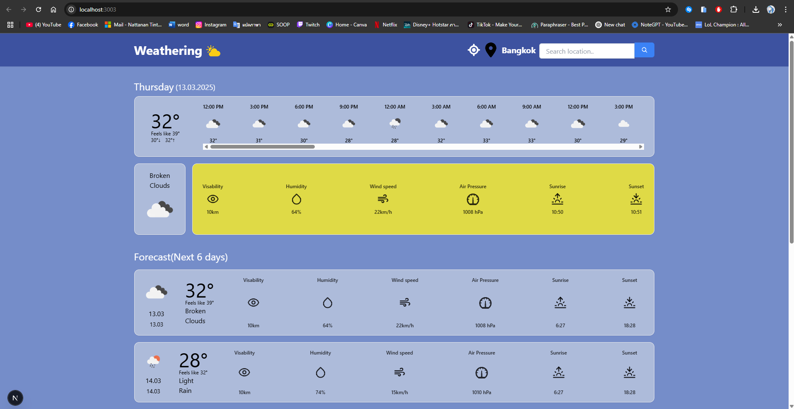

# 🌤️ Weathering App

ยินดีต้อนรับสู่ **Weathering App** เว็บแอปพลิเคชันที่ช่วยให้คุณตรวจสอบสภาพอากาศได้ง่ายๆ ด้วยอินเทอร์เฟซที่สวยงามและใช้งานง่าย

## ตัวอย่างเว็บ


## 📌 คุณสมบัติที่สำคัญ

- **แสดงสภาพอากาศปัจจุบัน**: ดูข้อมูลสภาพอากาศปัจจุบันได้อย่างรวดเร็วและแม่นยำ
- **พยากรณ์อากาศรายวัน**: แสดงข้อมูลพยากรณ์อากาศล่วงหน้า 5 วัน เพื่อช่วยให้คุณเตรียมพร้อมในทุกสถานการณ์
- **ระบบค้นหาตำแหน่งที่ตั้ง**: ค้นหาสภาพอากาศของเมืองต่างๆ ทั่วโลกอย่างง่ายดาย
- **อินเทอร์เฟซที่เรียบง่ายและทันสมัย**: ออกแบบมาให้ใช้งานง่าย สบายตา และเหมาะกับผู้ใช้ทุกวัย

## 🚀 วิธีการติดตั้ง

1. โคลนโปรเจกต์ไปยังเครื่องของคุณ:

   ```bash
   git clone https://github.com/Celimine09/weather-app.git
   ```

2. ติดตั้ง dependencies:

   ```bash
   npm install
   ```

3. เรียกใช้งานโปรเจกต์:

   ```bash
   npm start
   ```

4. เปิดเบราว์เซอร์แล้วไปที่:
   ```bash
   http://localhost:3000
   ```

## 🛠️ เทคโนโลยีที่ใช้

- **NEXTJS**
- **TYPESCRIPT**
- **TAILWINDCSS**
- **API จาก OpenWeatherMap**

ขอบคุณที่สนใจในโปรเจกต์นี้!🎉
